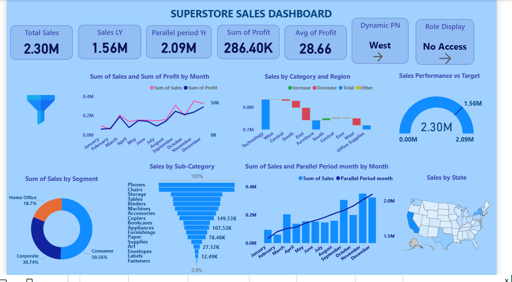

# 📊 Superstore Sales Dashboard – Power BI

## 📌 Project Overview
This project is an interactive sales analysis dashboard built using Power BI.  
It analyzes the Superstore dataset to understand sales performance, profit trends, customer segments, and regional performance.

---

## 🎯 Objectives
- Analyze sales and profit performance
- Identify top performing categories
- Track monthly sales trends
- Compare sales with targets

---

## 📊 Dashboard Features
- Total Sales KPI
- Sales Last Year Comparison
- Profit Analysis
- Sales by Category
- Sales by Sub-Category
- Sales by Segment
- Sales by Region
- Sales by State Map

---

## ⚙️ Advanced Power BI Features
- Row Level Security (RLS)
- Bookmarks
- Drill Through
- Page Navigation
- DAX Measures

---

## 🛠 Tools Used
- Power BI
- DAX
- Power Query
- Data Visualization

---

## 📸 Dashboard

---

## 👩‍💻 Author
Suganthi Ganesan  
M.Sc Information Technology  
